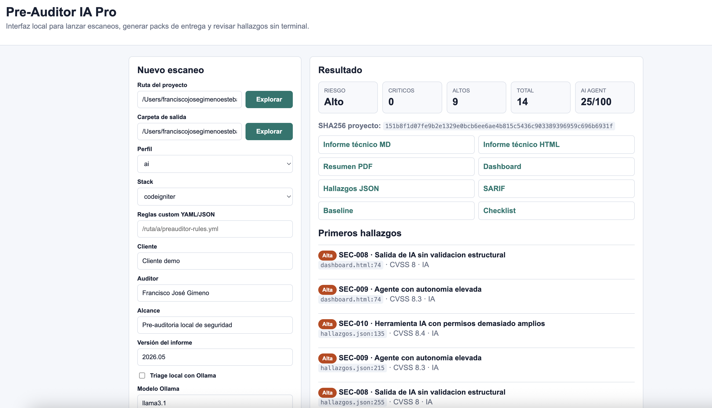
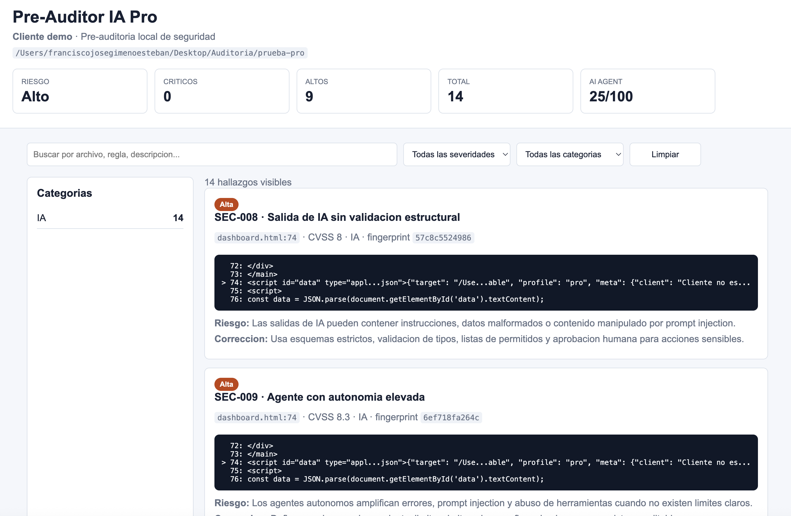
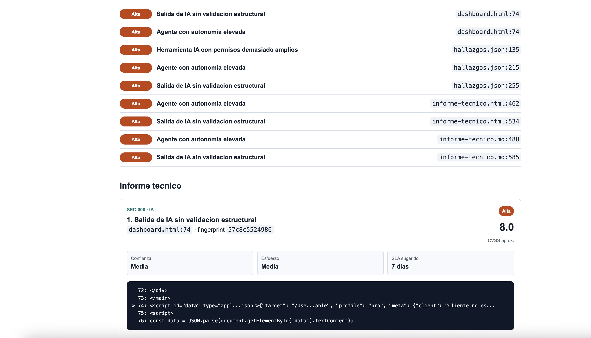

# Pre-Auditor IA Pro

Herramienta local para hacer una primera lectura profesional de riesgos en proyectos con APIs, automatizaciones, infraestructura e integraciones de IA. No pretende ser el auditor final: detecta patrones, prioriza hallazgos y genera un informe inicial para abrir una revision experta.

> Esta auditoria automatica no sustituye una revision experta. Los hallazgos deben ser validados por un consultor especializado, ya que pueden existir falsos positivos, falsos negativos y riesgos contextuales no detectables automaticamente.

## Instalacion como comando

Para instalarlo como comando local `preauditor`:

```bash
python3 -m pip install -e . --no-build-isolation
```

O instala el wheel generado en `dist/`:

```bash
python3 -m pip install dist/preauditor_ia-0.1.0-py3-none-any.whl
```

Tambien puedes usar el instalador local:

```bash
sh install.sh
```

Comprueba la instalacion:

```bash
preauditor --profile pro --list-rules
```

## Interfaz web local

Ademas de la CLI, puedes usar una interfaz local en navegador:

```bash
preauditor-ui
```

Abre:

```text
http://127.0.0.1:8765
```

Desde esa pantalla puedes:

- indicar la ruta del proyecto
- seleccionar perfil y stack
- rellenar cliente, auditor, alcance y version
- activar triage local con Ollama si lo tienes arrancado
- generar el pack completo de entrega
- abrir informe, PDF, dashboard, JSON, SARIF, baseline y checklist

Si quieres que intente abrir el navegador automaticamente:

```bash
preauditor-ui --open
```

### Ejecución en terminal / interfaz local



## Que detecta

El perfil `pro` incluye 100 reglas activas repartidas por API, IA, CI/CD, supply chain, secretos, contenedores, Kubernetes, cloud/Terraform, infraestructura, autenticacion, sesiones, frontend, privacidad, resiliencia, criptografia e inyecciones.

- API keys, tokens y secretos expuestos
- Archivos `.env`, claves privadas y ficheros de credenciales
- CORS abierto
- Endpoints aparentemente sin autenticacion
- Permisos excesivos en GitHub Actions
- Uso de `eval`, `exec`, `shell_exec`, `subprocess(..., shell=True)` y similares
- Prompts de sistema visibles
- Llamadas a IA que requieren validacion de salida
- Agentes con autonomia elevada
- Herramientas IA con permisos amplios
- Logs con datos sensibles
- Subida de archivos sin validacion evidente
- SQL construido por concatenacion
- TLS desactivado
- Debug activo
- Deserializacion insegura
- JWT sin verificacion de firma
- Criptografia debil
- CSP permisiva
- Contenedores privilegiados o root
- Infraestructura abierta a `0.0.0.0/0`
- SSRF potencial por URL controlada
- Secretos en Dockerfile
- `curl | bash` y riesgos de supply chain
- Cookies sin atributos de seguridad
- GitHub Actions con `pull_request_target`
- Actions sin fijar a SHA de commit
- Checkout con credenciales persistidas
- Secretos/OIDC en jobs de CI
- Uso de `sudo` en pipelines
- Dependencias instaladas sin version fija
- Imagenes Docker con `latest`
- Kubernetes privilegiado, `hostPath`, root o RBAC excesivo
- IAM con wildcards
- Buckets S3 publicos
- Bases de datos o workloads cloud expuestos
- Autenticacion/autorizacion desactivada
- Credenciales por defecto
- Path traversal, XXE, redirect abierto y XSS
- Webhooks sin verificacion de firma
- RAG/embeddings sin control de fuente
- Ejecucion de codigo influida por IA
- Telemetria/logs de IA con posible contenido sensible
- HSTS, TLS antiguo y cabeceras anti-clickjacking
- OAuth redirect URI inseguro, `state`/`nonce` ausente y JWT `none`
- Cifrado en reposo desactivado
- Backups, snapshot final o proteccion contra borrado desactivados
- PII en logs
- Cache de CI con `.env` o credenciales
- Docker `COPY .`, `ADD` remoto y capabilities amplias
- Kubernetes service account token automontado
- GraphQL introspection/playground en produccion
- Errores detallados o stack traces expuestos
- CORS reflejando origen dinamico
- Guardrails, moderacion o validacion de salida IA desactivados
- Swagger/OpenAPI o Actuator expuestos
- Elasticsearch, Redis, MongoDB, RabbitMQ, Kafka o MinIO inseguros
- Lockfiles ausentes o instalacion no reproducible en CI
- Dependencias `latest`, comodin, Git o rutas locales
- TLS/integridad desactivada en gestores de paquetes
- Comandos destructivos en pipelines
- Terraform backend/state y outputs sensibles
- Buckets publicos en Azure/GCP
- MFA desactivado y ausencia de proteccion anti-replay

## Uso

```bash
python3 preauditor.py /ruta/al/proyecto --profile pro --out informe.md --html informe.html --json hallazgos.json --sarif hallazgos.sarif
```

Ejemplo desde esta carpeta:

```bash
python3 preauditor.py ./sample-vulnerable --profile pro --out reports/sample-pro.md --html reports/sample-pro.html --json reports/sample-pro.json --sarif reports/sample-pro.sarif
```

La CLI devuelve codigo `1` si encuentra hallazgos criticos o altos por defecto. Puedes ajustar el umbral:

```bash
python3 preauditor.py ./mi-app --fail-on Critica
python3 preauditor.py ./mi-app --fail-on never
```

## Perfiles

- `basic`: reglas esenciales para una version gratuita o lead magnet.
- `pro`: reglas ampliadas, scoring, exportaciones y reporte profesional.
- `ai`: foco en agentes IA, permisos, prompts, CI/CD y secretos.
- `api`: foco en APIs, autenticacion, sesiones, frontend, privacidad e inyecciones.
- `cloud`: foco en cloud, Kubernetes, contenedores, infraestructura y resiliencia.
- `cicd`: foco en pipelines, supply chain, secretos y agentes.
- `fintech`: foco en APIs, autenticacion, privacidad, criptografia, cloud, CI/CD e IA.

Para ver el catalogo completo de reglas:

```bash
python3 preauditor.py --profile pro --list-rules
```

## Modo cliente

Puedes personalizar la portada y metadatos del informe:

```bash
python3 preauditor.py ./mi-app \
  --profile fintech \
  --client "ACME Payments" \
  --auditor "Tu Nombre / Tu Empresa" \
  --scope "Revision inicial de seguridad de API, CI/CD e IA" \
  --report-version "2026.05" \
  --out informe-acme.md \
  --html informe-acme.html \
  --pdf informe-acme.pdf \
  --dashboard dashboard-acme.html
```

El dashboard es un HTML local con busqueda, filtro por severidad y filtro por categoria. El PDF se genera automaticamente con `reportlab` cuando esta disponible en el Python que ejecuta la herramienta.

### Dashboard local



### Informe PDF



## Pack de entrega

Para generar una carpeta lista para entregar:

```bash
preauditor ./mi-app \
  --profile pro \
  --stack springboot \
  --client "ACME" \
  --auditor "Francisco José Gimeno" \
  --scope "Pre-auditoria de seguridad aplicacion/API/CI-CD" \
  --report-version "2026.05" \
  --deliverable ACME-preauditoria-2026-05 \
  --fail-on never
```

La carpeta contiene:

- `informe-tecnico.md`
- `informe-tecnico.html`
- `resumen-direccion.pdf`
- `dashboard.html`
- `hallazgos.json`
- `hallazgos.sarif`
- `baseline.json`
- `checklist-remediacion.md`

## Baseline y comparativas

Primera auditoria:

```bash
preauditor ./mi-app --profile pro --baseline baseline.json --out informe.md
```

Auditorias posteriores:

```bash
preauditor ./mi-app --profile pro --compare baseline.json --out informe-comparado.md
```

La salida indica hallazgos nuevos, corregidos y persistentes.

## Triage local con Ollama

Opcionalmente puedes usar Ollama como segundo analista local para revisar los hallazgos mas complejos antes de que los mire el auditor humano. Por defecto no elimina hallazgos: solo añade un veredicto de triage al Markdown, HTML, PDF, dashboard y JSON.

Primero arranca Ollama y descarga un modelo:

```bash
ollama pull llama3.1
ollama serve
```

Despues lanza el escaneo con triage:

```bash
preauditor ./mi-app \
  --profile pro \
  --ollama \
  --ollama-model llama3.1 \
  --ollama-min-severity Alta \
  --out informe.md \
  --html informe.html \
  --json hallazgos.json
```

Campos que añade:

- `probable_real`: parece un hallazgo real y debe priorizarse.
- `requiere_revision`: falta contexto y debe validarlo el auditor.
- `probable_falso_positivo`: puede no aplicar al contexto real.

Si quieres que el informe oculte automaticamente hallazgos que Ollama marque como probable falso positivo con confianza media o alta, usa:

```bash
preauditor ./mi-app --profile pro --ollama --ollama-filter-fp
```

Recomendacion profesional: usa `--ollama-filter-fp` solo en revisiones internas o CI/CD. Para entregables de cliente, es mejor dejar los hallazgos visibles con su etiqueta de triage para no esconder riesgos contextuales.

## Supresion de falsos positivos

Si un hallazgo ya fue validado y aceptado, crea un archivo `.preauditor-ignore` en la raiz del proyecto escaneado o pasa uno con `--ignore-file`.

Formatos soportados:

```text
SEC-032
SEC-032 .github/workflows/legacy.yml
SEC-032:path/**/*.yml
fingerprint:a1b2c3d4e5f6
file:docs/**
```

Hay una plantilla en `.preauditor-ignore.example`.

## Reglas custom YAML/JSON

Puedes añadir reglas propias sin tocar el motor de Python. Esto sirve para politicas internas, patrones de cliente, nombres de dominios, flags prohibidos o configuraciones que solo aplican a tu empresa.

Ejemplo:

```yaml
rules:
  - id: ACME-001
    title: Flag de bypass interno activado
    severity: Critica
    category: Custom
    regexes:
      - bypassAuth\s*[:=]\s*true
      - DISABLE_AUTH\s*=\s*true
    file_globs:
      - "*.js"
      - "*.ts"
      - "*.py"
      - "*.env*"
    recommendation: Eliminar el flag o limitarlo a tests aislados.
```

Uso:

```bash
preauditor ./mi-app --profile pro --rules-file examples/custom-rules.yml --out informe.md
```

Campos principales: `id`, `title`, `severity`, `category`, `regex` o `regexes`, `file_globs`, `description`, `why_dangerous`, `exploit_concept`, `recommendation`, `secure_example` y `reference`.

Hay un ejemplo listo en `examples/custom-rules.yml`.

## Tests de la herramienta

Los tests no auditan un proyecto: verifican que el propio motor sigue detectando reglas criticas y que no se rompen las salidas principales.

```bash
python3 -m unittest discover -s tests
```

Cubren secretos, workflows IA, hallazgos compuestos, perfiles, supresiones y metadatos del informe.

Las pruebas de Ollama no llaman al modelo real: verifican el parseo de JSON y el filtro explicito de falsos positivos para que la suite siga siendo rapida y reproducible.

## Hallazgos compuestos

Ademas de reglas individuales, el motor genera hallazgos compuestos cuando detecta combinaciones peligrosas, por ejemplo:

- Workspace confiable + prompt desde PR + permisos de escritura del agente.
- CORS abierto + credenciales habilitadas.

## Estructura del informe

El informe generado tiene dos partes:

- Resumen para direccion: riesgo global, conteo por severidad, impacto de negocio y prioridades.
- Informe tecnico: evidencia enmascarada, contexto, archivo, linea aproximada, CVSS aproximado, confianza, esfuerzo, SLA sugerido, descripcion, explotacion conceptual, correccion, ejemplo seguro, referencia OWASP y checklist.

## Exportaciones profesionales

- Markdown para entrega rapida o revision interna.
- HTML imprimible para cliente y conversion manual a PDF desde el navegador.
- JSON para integraciones propias.
- SARIF 2.1.0 para pipelines y plataformas compatibles con code scanning.

## Tipos de archivo soportados

El escaner revisa codigo y configuracion en texto plano (`.py`, `.js`, `.ts`, `.yml`, `.yaml`, `.md`, `.tf`, `Dockerfile`, etc.) y tambien extrae texto basico de `.docx` para contrastar informes o documentos de auditoria.

Si quieres revisar un unico archivo, colocalo dentro de una carpeta y escanea esa carpeta:

```bash
mkdir -p /tmp/preaudit-check
cp /ruta/al/archivo.docx /tmp/preaudit-check/
python3 preauditor.py /tmp/preaudit-check --profile pro --out informe-docx.md --html informe-docx.html
```

## Modelo profesional sugerido

- Herramienta local gratuita: escaneo basico, informe resumido y reglas iniciales.
- Version profesional: mas reglas, HTML imprimible, CVSS aproximado, SARIF, exportacion para cliente y recomendaciones avanzadas.
- Servicio experto: validacion manual, correccion de codigo, formacion del equipo y plan de mitigacion.

## Limitaciones

El motor usa reglas estaticas y patrones, y opcionalmente puede apoyarse en Ollama para triage local. Esto es rapido y transparente, pero puede producir falsos positivos y falsos negativos. Los riesgos de arquitectura, logica de negocio, autorizacion contextual y explotabilidad real requieren revision experta.
