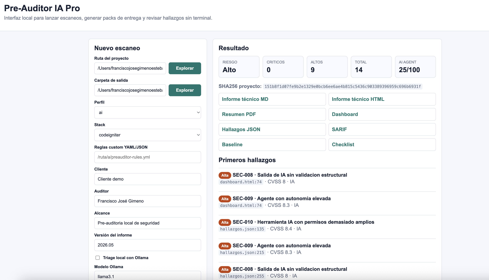
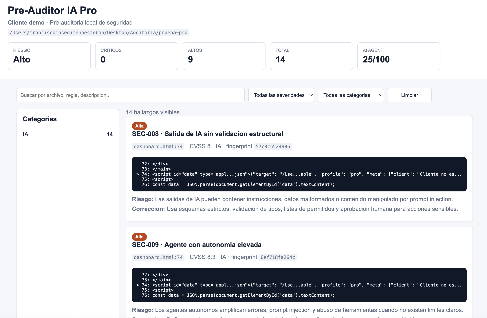
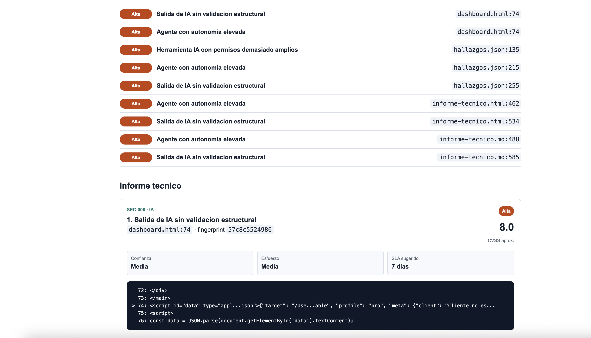

# Pre-Auditor IA Pro

Herramienta local para hacer un análisis preliminar de riesgos en proyectos con APIs, automatizaciones, infraestructura e integraciones de IA. No pretende ser el auditor final: detecta patrones, prioriza hallazgos y genera entregables para revisión experta del equipo.

> Esta auditoría automática no sustituye una revisión experta. Los hallazgos deben ser validados por una persona especializada, ya que pueden existir falsos positivos, falsos negativos y riesgos contextuales no detectables automáticamente.

## Instalación como comando

Pre-Auditor IA Pro instala dos comandos locales:

- `preauditor`
- `preauditor-ui`

### Instalación rápida recomendada

Instala el wheel publicado en la release `v0.2.0`:

```bash
python3 -m pip install "https://github.com/fran25ans/preauditor-ia-pro/releases/download/v0.2.0/preauditor_ia-0.2.0-py3-none-any.whl"
```

Comprueba la instalación:

```bash
preauditor --profile pro --list-rules
preauditor-ui
```

Página de la release:

```text
https://github.com/fran25ans/preauditor-ia-pro/releases/tag/v0.2.0
```

### Instalación aislada con pipx

Recomendado si quieres usarlo como herramienta de línea de comandos sin mezclar dependencias con otros proyectos:

```bash
python3 -m pip install pipx
python3 -m pipx install "https://github.com/fran25ans/preauditor-ia-pro/releases/download/v0.2.0/preauditor_ia-0.2.0-py3-none-any.whl"
```

### Desde el tag de GitHub

Instala directamente una versión concreta del repositorio:

```bash
python3 -m pip install "git+https://github.com/fran25ans/preauditor-ia-pro.git@v0.2.0"
```

### Desde un wheel local

Si ya tienes el archivo `.whl` descargado:

```bash
python3 -m pip install preauditor_ia-0.2.0-py3-none-any.whl
```

O, si estás dentro del proyecto y tienes el wheel generado en `dist/`:

```bash
python3 -m pip install dist/preauditor_ia-0.2.0-py3-none-any.whl
```

### Desde el código fuente

Para desarrollo local, instala en modo editable:

```bash
python3 -m pip install -e . --no-build-isolation
```

También puedes usar el instalador local del repositorio:

```bash
sh install.sh
```

### Reinstalar la versión publicada

Si ya tenías una versión previa instalada y quieres reinstalar:

```bash
python3 -m pip install --force-reinstall "https://github.com/fran25ans/preauditor-ia-pro/releases/download/v0.2.0/preauditor_ia-0.2.0-py3-none-any.whl"
```

## Interfaz web local

Además de la CLI, puedes usar una interfaz local en navegador:

```bash
preauditor-ui
```

Abre:

```text
http://127.0.0.1:8765
```

Desde esa pantalla puedes:

- indicar la ruta del proyecto
- seleccionar perfil y stack
- rellenar cliente, auditor, alcance y versión
- elegir idioma de informes: español o inglés
- comparar contra un `baseline.json` anterior para ver antes/después
- marcar validación humana persistente en `review.json`
- activar triage local con Ollama si lo tienes arrancado
- generar el pack completo de entrega
- abrir informe, PDF, dashboard, JSON, SARIF, baseline y checklist

Si quieres que intente abrir el navegador automáticamente:

```bash
preauditor-ui --open
```

### Modelo de seguridad de la UI local

La interfaz web está pensada para uso local del equipo, no como servicio público ni SaaS.

Controles aplicados:

- escucha en `127.0.0.1` por defecto
- rechaza siempre arrancar fuera de loopback
- token aleatorio por sesión para operaciones `POST`
- validación de `Host` y `Origin`
- peticiones `POST` solo con `Content-Type: application/json`
- límite de tamaño para peticiones
- cabeceras `Content-Security-Policy`, `X-Content-Type-Options`, `Referrer-Policy`, `Cache-Control` y `X-Frame-Options`
- los artefactos se sirven solo desde carpetas de entrega generadas por la herramienta
- las escrituras fuera de la carpeta de trabajo requieren confirmación explícita en la UI

La UI no admite escucha remota. Si necesitas compartir resultados, distribuye los artefactos generados en lugar de exponer el proceso local.

### Ejecución en terminal / interfaz local



## Qué detecta

El perfil `pro` incluye 100 reglas activas repartidas por API, IA, CI/CD, supply chain, secretos, contenedores, Kubernetes, cloud/Terraform, infraestructura, autenticación, sesiones, frontend, privacidad, resiliencia, criptografía e inyecciones.

- API keys, tokens y secretos expuestos
- Archivos `.env`, claves privadas y ficheros de credenciales
- CORS abierto
- Endpoints aparentemente sin autenticación
- Permisos excesivos en GitHub Actions
- Uso de `eval`, `exec`, `shell_exec`, `subprocess(..., shell=True)` y similares
- Prompts de sistema visibles
- Llamadas a IA que requieren validación de salida
- Agentes con autonomía elevada
- Herramientas IA con permisos amplios
- Logs con datos sensibles
- Subida de archivos sin validación evidente
- SQL construido por concatenación
- TLS desactivado
- Debug activo
- Deserialización insegura
- JWT sin verificación de firma
- Criptografía débil
- CSP permisiva
- Contenedores privilegiados o root
- Infraestructura abierta a `0.0.0.0/0`
- SSRF potencial por URL controlada
- Secretos en Dockerfile
- `curl | bash` y riesgos de supply chain
- Cookies sin atributos de seguridad
- GitHub Actions con `pull_request_target`
- Actions sin fijar a SHA de commit
- Checkout con credenciales persistidas
- Secretos/OIDC en jobs de CI
- Uso de `sudo` en pipelines
- Dependencias instaladas sin version fija
- Imágenes Docker con `latest`
- Kubernetes privilegiado, `hostPath`, root o RBAC excesivo
- IAM con wildcards
- Buckets S3 públicos
- Bases de datos o workloads cloud expuestos
- Autenticación/autorización desactivada
- Credenciales por defecto
- Path traversal, XXE, redirect abierto y XSS
- Webhooks sin verificación de firma
- RAG/embeddings sin control de fuente
- Ejecución de código influida por IA
- Telemetría/logs de IA con posible contenido sensible
- HSTS, TLS antiguo y cabeceras anti-clickjacking
- OAuth redirect URI inseguro, `state`/`nonce` ausente y JWT `none`
- Cifrado en reposo desactivado
- Backups, snapshot final o protección contra borrado desactivados
- PII en logs
- Cache de CI con `.env` o credenciales
- Docker `COPY .`, `ADD` remoto y capabilities amplias
- Kubernetes service account token automontado
- GraphQL introspection/playground en producción
- Errores detallados o stack traces expuestos
- CORS reflejando origen dinámico
- Guardrails, moderación o validación de salida IA desactivados
- Swagger/OpenAPI o Actuator expuestos
- Elasticsearch, Redis, MongoDB, RabbitMQ, Kafka o MinIO inseguros
- Lockfiles ausentes o instalación no reproducible en CI
- Dependencias `latest`, comodín, Git o rutas locales
- TLS/integridad desactivada en gestores de paquetes
- Comandos destructivos en pipelines
- Terraform backend/state y outputs sensibles
- Buckets públicos en Azure/GCP
- MFA desactivado y ausencia de protección anti-replay

## Uso

```bash
python3 preauditor.py /ruta/al/proyecto --profile pro --out informe.md --html informe.html --json hallazgos.json --sarif hallazgos.sarif
```

Ejemplo desde esta carpeta:

```bash
python3 preauditor.py ./sample-vulnerable --profile pro --out reports/sample-pro.md --html reports/sample-pro.html --json reports/sample-pro.json --sarif reports/sample-pro.sarif
```

La CLI devuelve código `1` si encuentra hallazgos críticos o altos por defecto. Puedes ajustar el umbral:

```bash
python3 preauditor.py ./mi-app --fail-on Critica
python3 preauditor.py ./mi-app --fail-on never
```

### Informes en inglés

Puedes generar los entregables principales en inglés:

```bash
preauditor ./mi-app \
  --profile pro \
  --language en \
  --out report.md \
  --html report.html \
  --pdf executive-summary.pdf \
  --dashboard dashboard.html \
  --json findings.json
```

La opción también está disponible en la UI local en el campo `Idioma de la interfaz e informes`. Al seleccionar `English`, cambia la vista principal, los modales, el catálogo de reglas, los mensajes de escaneo y los entregables generados. El Markdown, HTML, PDF, dashboard, checklist, JSON, SARIF y baseline conservan el idioma elegido en sus metadatos y muestran los hallazgos core en inglés.

Las evidencias y fragmentos de código se mantienen literalmente como aparecen en el proyecto auditado. Las reglas custom se muestran en el idioma en que estén escritas en su YAML/JSON.

## Perfiles

- `basic`: reglas esenciales para una revisión rápida.
- `pro`: reglas ampliadas, scoring, exportaciones y reporte completo.
- `ai`: foco en agentes IA, permisos, prompts, CI/CD y secretos.
- `api`: foco en APIs, autenticación, sesiones, frontend, privacidad e inyecciones.
- `cloud`: foco en cloud, Kubernetes, contenedores, infraestructura y resiliencia.
- `cicd`: foco en pipelines, supply chain, secretos y agentes.
- `fintech`: foco en APIs, autenticación, privacidad, criptografía, cloud, CI/CD e IA.

Para ver el catálogo completo de reglas:

```bash
python3 preauditor.py --profile pro --list-rules
```

## Modo cliente

Puedes personalizar la portada y metadatos del informe:

```bash
python3 preauditor.py ./mi-app \
  --profile fintech \
  --client "ACME Payments" \
  --auditor "Tu Nombre / Tu Empresa" \
  --scope "Revisión inicial de seguridad de API, CI/CD e IA" \
  --report-version "2026.05" \
  --out informe-acme.md \
  --html informe-acme.html \
  --pdf informe-acme.pdf \
  --dashboard dashboard-acme.html
```

El dashboard es un HTML local con búsqueda, filtro por severidad y filtro por categoría. El PDF se genera automáticamente con `reportlab` cuando está disponible en el Python que ejecuta la herramienta.

### Dashboard local



### Informe PDF



## Pack de entrega

Para generar una carpeta lista para entregar:

```bash
preauditor ./mi-app \
  --profile pro \
  --stack springboot \
  --client "ACME" \
  --auditor "Francisco José Gimeno" \
  --scope "Análisis preliminar de seguridad aplicación/API/CI-CD" \
  --report-version "2026.05" \
  --deliverable ACME-preauditoria-2026-05 \
  --fail-on never
```

La carpeta contiene:

- `informe-tecnico.md`
- `informe-tecnico.html`
- `resumen-direccion.pdf`
- `dashboard.html`
- `hallazgos.json`
- `hallazgos.sarif`
- `baseline.json`
- `checklist-remediacion.md`

## Baseline y comparativas

Primera auditoría:

```bash
preauditor ./mi-app --profile pro --baseline baseline.json --out informe.md
```

Auditorías posteriores:

```bash
preauditor ./mi-app --profile pro --compare baseline.json --out informe-comparado.md
```

La salida indica hallazgos nuevos, corregidos y persistentes.

En la UI local, la opción `Comparar con baseline anterior de la carpeta de salida` viene activada por defecto. El flujo recomendado es:

1. Ejecutar un primer escaneo para generar `baseline.json`.
2. Corregir hallazgos en el proyecto.
3. Ejecutar de nuevo usando la misma carpeta de salida.
4. Revisar la tarjeta `Comparativa antes/después` en la UI y en el dashboard.

Esto permite demostrar progreso: hallazgos nuevos, corregidos, persistentes y porcentaje de mejora.

Puedes reproducir un ejemplo completo con resultados medidos en [el caso práctico antes/después](docs/case-study-before-after.md).

## Validación humana persistente

La herramienta diferencia entre detección automática, triage opcional con Ollama y validación humana. La decisión humana se guarda en `review.json`, indexada por fingerprint del hallazgo.

Estados disponibles:

- `pending`: pendiente de revisar.
- `confirmed`: confirmado manualmente.
- `false_positive`: falso positivo.
- `accepted_risk`: riesgo aceptado.
- `fixed`: corregido.
- `revalidated`: revalidado tras corrección.

El archivo `review.json` conserva:

- fingerprint
- estado
- revisor
- fecha de revisión
- razonamiento
- ticket
- commit de corrección
- evidencia de verificación

Ollama no modifica estos estados. Solo aporta triage auxiliar; el veredicto humano queda separado y persistente.

## Triage local con Ollama

Opcionalmente puedes usar Ollama como segundo analista local para revisar los hallazgos más complejos antes de que los mire el auditor humano. Por defecto no elimina hallazgos: solo añade un veredicto de triage al Markdown, HTML, PDF, dashboard y JSON.

Primero arranca Ollama y descarga un modelo:

```bash
ollama pull llama3.1
ollama serve
```

Después lanza el escaneo con triage:

```bash
preauditor ./mi-app \
  --profile pro \
  --ollama \
  --ollama-model llama3.1 \
  --ollama-min-severity Alta \
  --out informe.md \
  --html informe.html \
  --json hallazgos.json
```

Campos que añade:

- `probable_real`: parece un hallazgo real y debe priorizarse.
- `requiere_revision`: falta contexto y debe validarlo el auditor.
- `probable_falso_positivo`: puede no aplicar al contexto real.

Si quieres que el informe oculte automáticamente hallazgos que Ollama marque como probable falso positivo con confianza media o alta, usa:

```bash
preauditor ./mi-app --profile pro --ollama --ollama-filter-fp
```

Recomendación: usa `--ollama-filter-fp` solo en revisiones internas o CI/CD. Para entregables externos, es mejor dejar los hallazgos visibles con su etiqueta de triage para no esconder riesgos contextuales.

## Supresión de falsos positivos

Si un hallazgo ya fue validado y aceptado, crea un archivo `.preauditor-ignore` en la raíz del proyecto escaneado o pasa uno con `--ignore-file`.

Formatos soportados:

```text
SEC-032
SEC-032 .github/workflows/legacy.yml
SEC-032:path/**/*.yml
fingerprint:a1b2c3d4e5f6
file:docs/**
```

Hay una plantilla en `.preauditor-ignore.example`.

## Reglas custom YAML/JSON

Puedes añadir reglas propias sin tocar el motor de Python. Esto sirve para políticas internas, patrones de cliente, nombres de dominios, flags prohibidos o configuraciones que solo aplican a tu empresa.

El diseño recomendado es:

- Reglas core: incluidas en Pre-Auditor IA Pro, versionadas y de solo lectura.
- Reglas custom: editables por cliente/equipo en un archivo YAML o JSON externo.
- Triage Ollama: opcional, para justificar o priorizar hallazgos complejos, no para sustituir las reglas.

Ejemplo:

```yaml
rules:
  - id: ACME-001
    title: Flag de bypass interno activado
    severity: Critica
    category: Custom
    regexes:
      - bypassAuth\s*[:=]\s*true
      - DISABLE_AUTH\s*=\s*true
    file_globs:
      - "*.js"
      - "*.ts"
      - "*.py"
      - "*.env*"
    recommendation: Eliminar el flag o limitarlo a tests aislados.
```

Uso:

```bash
preauditor ./mi-app --profile pro --rules-file examples/custom-rules.yml --out informe.md
```

Campos principales: `id`, `title`, `severity`, `category`, `regex` o `regexes`, `file_globs`, `description`, `why_dangerous`, `exploit_concept`, `recommendation`, `secure_example` y `reference`.

Hay un ejemplo listo en `examples/custom-rules.yml`.

### Editor visual de reglas custom

La UI local incluye un editor para crear o modificar packs de reglas sin tocar `preauditor.py`:

```bash
preauditor-ui
```

Abre `http://127.0.0.1:8765/` y pulsa `Reglas custom`.

Desde ahí puedes:

- Cargar una plantilla YAML.
- Editar reglas propias del cliente.
- Validar que las regex compilan y que la severidad es correcta.
- Guardar el archivo `.yml`.
- Usarlo automáticamente en el siguiente escaneo.

Las reglas internas del catálogo no se editan desde la UI. Esto mantiene trazabilidad y evita alterar el criterio base de auditoría. Para adaptar la herramienta a una empresa, crea un pack externo tipo `acme-rules.yml` y versiónalo junto a la política de seguridad del cliente.

## Tests de la herramienta

Los tests no auditan un proyecto: verifican que el propio motor sigue detectando reglas críticas y que no se rompen las salidas principales.

```bash
python3 -m unittest discover -s tests
```

Cubren secretos, workflows IA, hallazgos compuestos, persistencia e invalidación de revisiones, seguridad de la UI local, perfiles, supresiones y metadatos del informe. GitHub Actions ejecuta la suite en Python 3.10, 3.11 y 3.12 en cada push y pull request.

Las pruebas de Ollama no llaman al modelo real: verifican el parseo de JSON y el filtro explícito de falsos positivos para que la suite siga siendo rápida y reproducible.

## Hallazgos compuestos

Además de reglas individuales, el motor genera hallazgos compuestos cuando detecta combinaciones peligrosas, por ejemplo:

- Workspace confiable + prompt desde PR + permisos de escritura del agente.
- CORS abierto + credenciales habilitadas.

## Estructura del informe

El informe generado tiene dos partes:

- Resumen para dirección: riesgo global, conteo por severidad, impacto de negocio y prioridades.
- Informe técnico: evidencia enmascarada, contexto, archivo, línea aproximada, CVSS aproximado, confianza, esfuerzo, SLA sugerido, descripción, explotación conceptual, corrección, ejemplo seguro, referencia OWASP y checklist.

## Exportaciones

- Markdown para entrega rápida o revisión interna.
- HTML imprimible para revisión y conversión manual a PDF desde el navegador.
- JSON para integraciones propias.
- SARIF 2.1.0 para pipelines y plataformas compatibles con code scanning.

## Tipos de archivo soportados

El escáner revisa código y configuración en texto plano (`.py`, `.js`, `.ts`, `.yml`, `.yaml`, `.md`, `.tf`, `Dockerfile`, etc.) y también extrae texto básico de `.docx` para contrastar informes o documentos de auditoría.

Si quieres revisar un único archivo, colócalo dentro de una carpeta y escanea esa carpeta:

```bash
mkdir -p /tmp/preaudit-check
cp /ruta/al/archivo.docx /tmp/preaudit-check/
python3 preauditor.py /tmp/preaudit-check --profile pro --out informe-docx.md --html informe-docx.html
```

## Modelo de uso sugerido

- Uso rápido: escaneo básico, informe resumido y reglas esenciales.
- Uso interno de equipo: perfil `pro`, dashboard, baseline, validación humana y pack de entrega.
- Uso experto: validación manual, corrección de código, formación del equipo y plan de mitigación.

## Limitaciones

El motor usa reglas estáticas y patrones, y opcionalmente puede apoyarse en Ollama para triage local. Esto es rápido y transparente, pero puede producir falsos positivos y falsos negativos. Los riesgos de arquitectura, lógica de negocio, autorización contextual y explotabilidad real requieren revisión experta.
